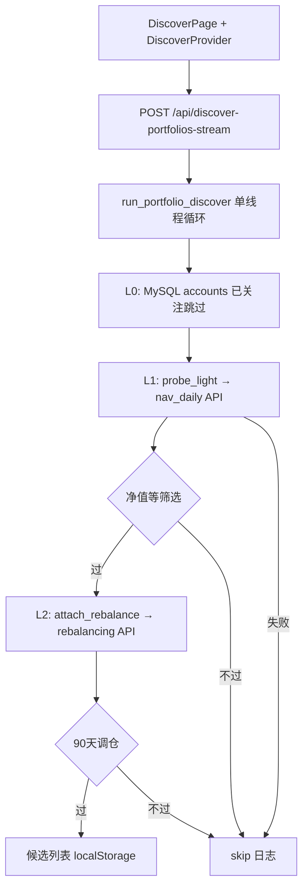

# 雪球 ZH 组合「挖组合」系统说明（供优化方案设计）

> 本文档描述当前已实现架构、瓶颈与约束，供其他 AI 设计**更快、更稳**的扫描方案。  
> 项目路径：`xueqiu`（FastAPI 后端 + React 前端），认证方式为本地 Cookie（`data/xueqiu_cookie.txt`）。

---

## 1. 业务目标

用户要在雪球组合号空间 **顺序枚举** `ZH{数字}`，找出符合口味的组合，进入**候选列表**（非自动关注），再到雪球网页人工复核。

| 维度 | 用户设定 |
|------|----------|
| 扫描起点 | `ZH1000000`（数字 `1000000`） |
| 扫描终点 | `ZH3565914`（数字上限，含） |
| 步长 | `1`（1000000, 1000001, …） |
| 全区间规模 | 约 **256 万个号** |
| L1 筛选 | 最新净值 ≥ **40**（约 40 倍，初始净值一般为 1） |
| L2 筛选 | 近 **90 天**内有成功调仓 |
| 产品语义 | 命中 → **候选**；关注/同步是复核后的可选操作 |

**核心矛盾**：全区间 256 万 × 每号至少 1 次 HTTP（过 L1 后再 +1 次 L2）在现有「单 Cookie + 串行 + 限速」下**极慢**；加快请求会触发雪球 **HTTP 400**（实测多为限流/过快，网页上组合仍可能存在）。

---

## 2. 当前架构（已实现）



### 2.1 关键文件

| 层级 | 路径 | 职责 |
|------|------|------|
| 领域逻辑 | `backend/xueqiu/domain/portfolio_discover.py` | 顺序扫描、L1/L2、防风控 sleep、SSE emit |
| 雪球 API | `backend/xueqiu/integrations/xueqiu/portfolio.py` | `fetch_cube_nav_daily`, `fetch_portfolio_rebalance` |
| HTTP 客户端 | `backend/xueqiu/integrations/xueqiu/client.py` | `XueQiuApiClient`，Cookie Session |
| API | `backend/xueqiu/api/main.py` | `POST /api/discover-portfolios-stream` |
| Schema | `backend/xueqiu/api/schemas.py` | `DiscoverPortfoliosRequest` 等 |
| 前端状态 | `frontend/src/features/discover/DiscoverProvider.tsx` | 连续爬取循环、日志、checkpoint |
| Checkpoint | `frontend/src/features/discover/discoverCheckpoint.ts` | localStorage，进度按 origin→end 算 % |
| 候选持久化 | `frontend/src/features/discover/discoverCandidates.ts` | localStorage 去重累积 |

已删除：`scripts/probe_zh_start.py`（全局二分找起点，因 ID 稀疏不可靠）。

---

## 3. 雪球 API 细节（当前唯一数据源）

### 3.1 L1 — 组合日净值

- **URL**: `https://xueqiu.com/cubes/nav_daily/all.json`
- **参数**: `cube_symbol=ZHxxxxxx`，可选 `since`（毫秒时间戳）、`until`
- **当前用法**: `probe_light` 只拉 **近 60 天**（`NAV_LIGHT_DAYS=60`）以减小 payload
- **返回**: 组合名 + 日净值列表（`value`, `percent`, `date`/`time`）
- **失败**: 无点 → 视为不存在；**HTTP 400** 常见（限流或 `since` 参数问题）→ 已实现去掉 `since` 重试一次

### 3.2 L2 — 最近调仓

- **URL**: `https://xueqiu.com/cubes/rebalancing/history.json`
- **参数**: `cube_symbol`, `page=1`, `count=1`（只取最新一批成功调仓）
- **仅当 L1 通过后调用**（省 API，但候选必须过 L2 时仍逃不掉第二次请求）

### 3.3 认证

- 浏览器导出的 Cookie 文件，无 OAuth
- `warm_up()` 先 GET `https://xueqiu.com/`
- 401/403 → 提示重新登录

### 3.4 未使用的潜在接口（待调研）

文档/逆向中可能存在、**当前代码未接入**的接口，例如：

- 组合搜索/榜单/推荐列表（若有，可跳过暴力枚举）
- 批量查询多个 `cube_symbol`
- 用户关注列表、广场热门组合
- 移动端 API（不同限流策略）
- 组合详情页内嵌 JSON（非官方 API）

**请优化方案优先考虑：是否存在「列表型」数据源，使不必扫 256 万个号。**

---

## 4. 扫描与筛选算法（现状）

对每个 `ZH{n}` **严格串行**：

```
1. exclude_followed? → skip（查本地 MySQL accounts，0 HTTP）
2. probe_light → 1× nav_daily
3. passes_nav_filters(min_nav=40, cum上下限可选)
4. attach_rebalance → 1× rebalancing（仅 L1 通过）
5. passes_rebalance_filters(max_inactive_days=90)
6. hit → 进入本批候选 + SSE
7. sleep(1.8~3.0s) + 失败时额外 2~4s
```

**退避重试**（`_call_with_backoff`）：400/429/502/503 等 → 8s / 15s / 25s 最多 3 次。

**命中率（经验）**：区间内大量号**不存在**或 400；偶发有效号如 `ZH1000115` 净值很低被 L1 刷掉。有效组合在百万段**稀疏分布**，不是从某 K 起连续都存在。

---

## 5. 前端交互（现状）

| 功能 | 实现 |
|------|------|
| 本批数量 | 填数字 → 单批 SSE；**留空** → 连续模式 |
| 连续模式 | 前端 loop，每轮 `batch_size=25` 调一次 stream，直到停止或 `end_goal` |
| Checkpoint | `zh_num_start` 下一批起点；`zh_num_progress_origin` 进度条基准（通常 1e6） |
| 日志 | SSE：`progress` / `skip` / `hit` / `log` / `done` |
| 中断 | AbortController；切页不中断（DiscoverProvider 在 AppShell） |
| 候选 | localStorage 跨批合并；可标记「已复核」 |

---

## 6. 性能粗算（为什么慢）

假设（保守）：

- 平均每号 **1.2 次 HTTP**（大量号 L1 失败仍要 1 次；约 10% 进 L2 再多 1 次）
- 每次间隔 **2.4s**（sleep 均值）
- 单号耗时 ≈ **2.4s + RTT(~0.3s)** ≈ **2.7s**

全区间 2,565,914 号：

- 时间 ≈ 2.7s × 2.57M ≈ **7.1e6 s ≈ 82 天**（单线程单 Cookie）
- 即使用 10 并发，仍受雪球 400 限制，未必线性加速

用户诉求：**在可接受风控前提下显著提高吞吐**，或**根本改变「枚举全部数字」的思路**。

---

## 7. 已观测问题（实盘日志）

| 现象 | 解读 |
|------|------|
| 连续多个 `HTTP 400` on nav_daily | 请求过快或雪球反爬；**不等于**组合不存在 |
| 相邻号有的 400、有的返回净值 | 稀疏 ID + 限流混合 |
| 放慢到 1.8~3s 仍觉得太慢 | 业务需要新范式，不仅是调 sleep |
| 带 `since` 的 URL 偶发 400 | 已 fallback 无 since 重试 |

示例失败 URL：

```
https://xueqiu.com/cubes/nav_daily/all.json?cube_symbol=ZH1000113&since=1774624302511
→ 400 Bad Request
```

---

## 8. 硬约束（优化方案必须面对）

1. **合规/ToS**：需考虑雪球服务条款；方案应说明风险，不建议未授权的激进爬取。
2. **单 Cookie 会话**：当前无多账号池；并发过高易 400。
3. **筛选语义**：用户坚持 L2「90 天内有调仓」→ 若无法从 L1 数据推断，则**无法在 L1 前完全省掉 rebalancing API**（除非换数据源或接受近似）。
4. **候选非关注**：结果只需轻量字段 + 雪球链接，不需入库全量调仓历史。
5. **可恢复**：必须支持 checkpoint 中断续扫（已实现）。
6. **人工复核**：最终人要打开 `https://xueqiu.com/P/{code}`，方案可包含「导出候选」即可。

---

## 9. 当前方案已尝试、未做的方向

### 已做

- L1/L2 分层减少无效 rebalancing
- nav 短窗口 60 天
- 指数退避 + 400 识别 + 文案区分限流 vs 不存在
- 连续爬取 + checkpoint + SSE 日志
- 候选 localStorage

### 未做（可供新方案参考）

| 方向 | 说明 |
|------|------|
| 并发 / 异步 | 仍单线程 `for` + `requests` |
| 多 Cookie 池 | 轮换账号提高 QPS |
| 代理 IP 池 | 分散限流 |
| 号段存在性 Bloom/缓存 | 记住「永久 400/空」号段，跳过大块空洞 |
| 步长 >1 抽样 | 会漏号，用户当前要全量 |
| 外部索引 | 爬雪球组合榜单/搜索/社交图谱反查 ZH 号 |
| 离线库 | 第三方是否有人维护 ZH 列表 |
| L2 延迟 | 先只按 L1 进「待复核」，人工或夜间批处理 L2 |
| 服务端 discover 表 | 候选写 MySQL，多机共享进度 |
| 批量 API | 若雪球支持 multi cube_symbol，一次请求多个 |
| Playwright | 浏览器渲染拿接口，重但像真人 |
| 机器学习预测号段密度 | 在高密度段加密、低密度段稀疏跳扫 |

---

## 10. 请下游 AI 回答的问题（设计任务）

1. **是否存在不必枚举 256 万个号的路径？**（榜单、搜索、爬虫目录页、sitemap、雪球站内组合索引等）
2. **在必须枚举的前提下**，最优的 **QPS / 并发 / Cookie 池 / 请求合并** 策略是什么？给出可落地的限流模型（避免 400）。
3. **L1+L2 能否合并为更少请求？** 例如 rebalancing 接口是否已含净值、或 nav 是否含最后调仓日。
4. **两级筛选能否改 pipeline？** 例如：Phase A 只 L1 写库 → Phase B 异步 L2 过滤；或 L2 改为「网页打开时再查」。
5. **号段空洞**：如何快速学习/标记「无效区间」减少无效 HTTP（历史 400 缓存、二进制索引文件）。
6. **工程架构**：应用内 worker 队列、Celery、独立扫描服务、Redis checkpoint 是否必要？
7. **给出量级估算**：目标例如「每天处理 10 万个号」需要多少并发、多少 Cookie、多大失败率。

---

## 11. API 契约（便于改后端不改前端）

### POST `/api/discover-portfolios-stream`

请求体（`DiscoverPortfoliosRequest`）核心字段：

```json
{
  "zh_num_start": 1000030,
  "batch_size": 25,
  "zh_num_end_goal": 3565914,
  "step": 1,
  "min_nav": 40.0,
  "max_inactive_days": 90,
  "exclude_followed": true
}
```

SSE 事件类型：

- `progress`: `{ type, current, total, code }`
- `skip`: `{ type, code, reason, preview? }`
- `hit`: `{ type, item: DiscoveredPortfolioItem }`
- `log`: `{ type, level, message }`
- `done`: `{ type, ok, scanned, matched_count, not_found, filtered_out, next_checkpoint, ... }`

### POST `/api/follow-portfolios`

候选复核后可选关注（`upsert_account` + 可选 `sync_from_xueqiu`）。

---

## 12. 数据模型（候选条目）

```typescript
interface DiscoveredPortfolioItem {
  account_code: string;      // ZH1000115
  account_name: string;
  latest_nav: number;
  cum_return_pct: number;
  latest_nav_date?: string;
  latest_trade_time?: string;  // L2 才有
}
```

---

## 13. 环境与运行

- 后端：`cd backend && python main.py`（默认端口 **8011**，见 `backend/.env`）
- 前端：`cd frontend && npm run dev`（Vite 代理 `/api`）
- Cookie：`python ../scripts/xueqiu_login.py` 或手动维护 `data/xueqiu_cookie.txt`

---

## 14. 总结一句话

**现状 = 对 ZH 数字做全量顺序暴力探测 + 每号 1~2 次雪球 JSON API + 串行 sleep 防 400；用户要更快，需要从「减少要扫的号」或「提高单位时间有效请求」或「弱化/延后 L2」三个方向重新设计，而不是只调 sleep 参数。**

---

*文档生成自当前代码库实现，若代码有变更请以仓库为准。*
